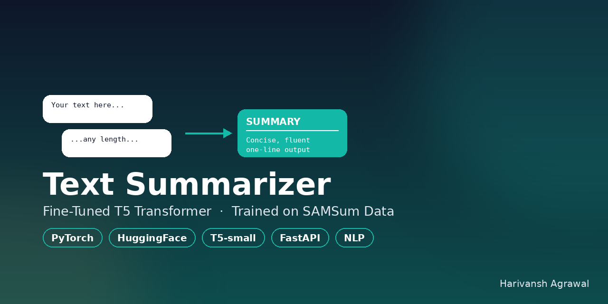
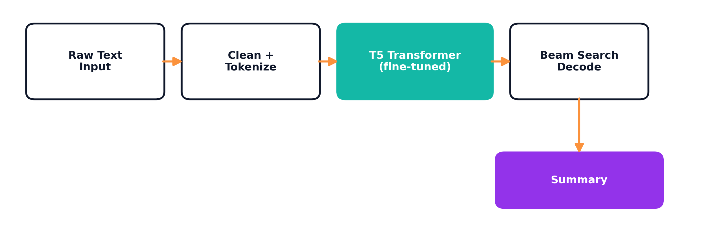
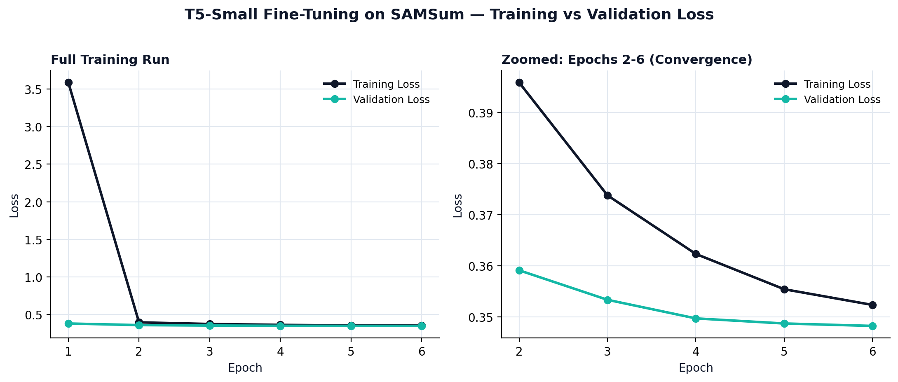
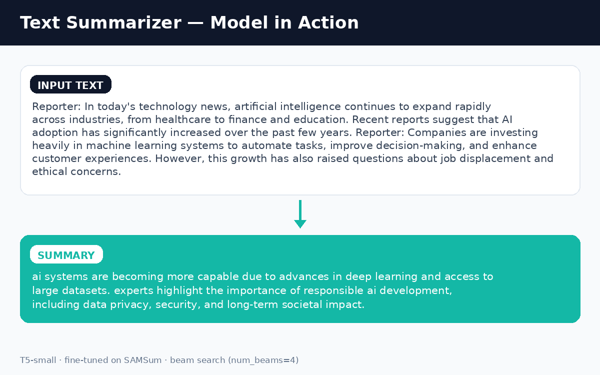

<div align="center">



# 📝 Text Summarizer — T5 Transformer for NLP Text Summarization
### A HuggingFace Transformer (T5) Fine-Tuned for Generative AI Text Summarization

[](https://www.python.org/)
[](https://pytorch.org/)
[](https://huggingface.co/transformers/)
[](https://huggingface.co/t5-small)
[](https://fastapi.tiangolo.com/)

</div>

A fine-tuned **T5 Transformer** (HuggingFace) that turns any block of text — chat conversations, articles, notes, explanations — into a short, fluent **abstractive summary**, using **Generative AI** / **NLP** sequence-to-sequence modeling. Trained on the **SAMSum** corpus and served through a **FastAPI** backend with a lightweight HTML/JS frontend.

Type or paste any content → get back a concise summary, generated in real time via beam search.

> 🌐 **Live Demo:** _not deployed yet — follow [`DEPLOYMENT.md`](DEPLOYMENT.md) to get a public HuggingFace Spaces link, then replace this line._

## 📌 Problem

Reading long conversations, articles, or notes end-to-end just to extract the gist is slow. This project fine-tunes a pretrained **T5 transformer** — a text-to-text Generative AI model — to compress arbitrary text into a fluent one-line summary, framing summarization the way T5 was designed to be used: **input text in, output text out.**

## 🧠 How It Works



## 📚 Dataset

**[SAMSum Corpus](https://huggingface.co/datasets/samsum)** (HuggingFace Datasets) — ~16K messenger-style conversations, each paired with a human-written abstractive summary.

| Split | Full size | Used for training |
|---|---|---|
| Train | 14,732 | 4,000 (random sample, `seed=42`) |
| Validation | 818 | 500 (random sample, `seed=42`) |

A random subsample was used to keep training time practical on a single machine (Apple Silicon MPS) while still covering diverse conversational patterns.

**Pre-processing:** line breaks and repeated whitespace collapsed, stray HTML tags stripped, text lowercased — the same `clean_data()` routine is reused in both training and inference (`app.py`) so the model always sees text in the format it was trained on.

## ⚙️ Model & Training

| Config | Value |
|---|---|
| Base model | `t5-small` — HuggingFace Transformer (60M params) |
| Task framing | Seq2Seq — `"text" → "summary"` (T5's native text-to-text format) |
| Input length | 512 tokens (max, padded/truncated) |
| Target length | 150 tokens (max, padded/truncated) |
| Epochs | 6 |
| Batch size | 8 (train & eval) |
| Warmup steps | 500 |
| Weight decay | 0.01 |
| Decoding | Beam search, `num_beams=4`, `early_stopping=True`, `max_length=150` |
| Hardware | Apple Silicon (MPS backend) |

## 📊 Results

| Epoch | Training Loss | Validation Loss |
|---|---|---|
| 1 | 3.5855 | 0.3802 |
| 2 | 0.3959 | 0.3591 |
| 3 | 0.3738 | 0.3534 |
| 4 | 0.3623 | 0.3497 |
| 5 | 0.3554 | 0.3487 |
| 6 | 0.3524 | **0.3483** |



Loss drops sharply after epoch 1 as the model adapts from general-purpose T5 pretraining to the summarization task, then converges smoothly — validation loss tracks training loss closely across all 6 epochs with no sign of overfitting.

### Example output



## 🛠️ Tech Stack

- **Modeling:** PyTorch, HuggingFace Transformers (`T5ForConditionalGeneration`, `T5Tokenizer`, `Trainer`) — Generative AI / NLP
- **Backend:** FastAPI + Pydantic, served with Uvicorn
- **Frontend:** Vanilla HTML / CSS / JS (fetch API, no build step)
- **Data handling:** pandas

## 📁 Project Structure

```
T5-Text-Summarizer-SAMSum/
├── app.py                      # FastAPI app — loads model, /summarize endpoint, serves UI
├── index.html                  # Frontend — textarea input, calls /summarize/
├── text_summarizer.ipynb       # Training notebook (data prep → fine-tuning → save)
├── requirements.txt
├── .gitignore
├── DEPLOYMENT.md               # Guide: get a live public URL (HuggingFace Spaces)
├── deploy/huggingface-space/   # Ready-to-push Docker deployment (Dockerfile, requirements, Space README)
├── assets/
│   ├── social_preview.png
│   ├── architecture_flow.png
│   ├── training_loss_curve.png
│   └── example_output.png
└── saved_summary_model/        # Fine-tuned weights (generated by the notebook, gitignored)
```

> **Note:** The trained model weights aren't included in this repo (large binaries, gitignored). Run `text_summarizer.ipynb` end-to-end to reproduce `saved_summary_model/`, or point `app.py` at your own checkpoint.

## 🚀 Running Locally

```bash
# 1. Clone and set up environment
git clone https://github.com/Harivansh124/T5-Text-Summarizer-SAMSum.git
cd T5-Text-Summarizer-SAMSum
python -m venv venv && source venv/bin/activate   # Windows: venv\Scripts\activate
pip install -r requirements.txt

# 2. Get the SAMSum CSVs (train/validation) and place them alongside the notebook,
#    then run text_summarizer.ipynb top to bottom to produce saved_summary_model/

# 3. Launch the app
uvicorn app:app --reload
```

Then open **http://127.0.0.1:8000** and paste in any text.

### API

```
POST /summarize/
Content-Type: application/json

{ "dialogue": "Amanda: I baked cookies. Do you want some?\nJerry: Sure!" }

→ { "summary": "amanda baked cookies and jerry wants some." }
```

## 🔮 Possible Extensions

- Quantitative evaluation with **ROUGE-1/2/L** on the held-out test split
- Swap in `t5-base` for higher-quality summaries (accuracy vs. latency trade-off)
- Deploy the API (Render / HuggingFace Spaces / Docker) for a live public demo
- Add streaming token-by-token output on the frontend

## 👤 Author

**Harivansh Agrawal**
AI/ML Engineer (transitioning from Indian Railways — Signal & Telecom) · Generative AI & Prompt Engineering
[GitHub](https://github.com/Harivansh124) · [LinkedIn](https://www.linkedin.com/in/harivansh-agrawal)

---
<div align="center"><i>Part of an ongoing applied AI/ML portfolio spanning NLP, computer vision, reinforcement learning, and unsupervised learning.</i></div>
